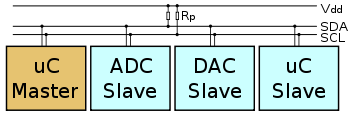

# I2C

**I²C (Inter-Integrated Circuit)** is a serial protocol for two-wire interface to connect low-speed devices like microcontrollers, EEPROMs, A/D and D/A converters, I/O interfaces and other similar peripherals in embedded systems. It was invented by [Philips](https://en.wikipedia.org/wiki/Philips) and now it is used by almost all major IC manufacturers. Each I²C slave device needs an address – they must still be obtained from [NXP](https://en.wikipedia.org/wiki/NXP_Semiconductors) (formerly Philips semiconductors).

  

I²C bus is popular because it is simple to use, there can be more than one master, only upper bus speed is defined and only two wires with pull-up resistors are needed to connect almost unlimited number of I²C devices. I²C can use even slower microcontrollers with general-purpose I/O pins since they only need to generate correct <i>Start and Stop conditions</i> in addition to functions for reading and writing a byte.

Each slave device has a unique address. Transfer from and to master device is serial and it is split into 8-bit packets. All these simple requirements make it very simple to implement I²C interface even with cheap microcontrollers that have no special I²C hardware controller. You only need 2 free I/O pins and few simple I²C routines to send and receive commands.

The initial I²C specifications defined maximum clock frequency of 100 kHz. This was later increased to 400 kHz as <i>Fast mode</i>. There is also a High speed mode which can go up to 3.4 MHz and there is also a 5 MHz ultra-fast mode.

## I2C Interface

I²C uses only two wires: SCL (serial clock) and SDA (serial data). Both need to be pulled up with a resistor to +Vdd. There are also I²C level shifters which can be used to connect to two I²C buses with different voltages.

## I2C Addresses

Basic I²C communication is using transfers of 8 bits or bytes. Each I²C slave device has a 7-bit address that needs to be unique on the bus. Some devices have fixed I²C address while others have few address lines which determine lower bits of the I²C address. This makes it very easy to have all I²C devices on the bus with unique I²C address. There are also devices which have 10-bit address as allowed by the specification.

7-bit address represents bits 7 to 1 while bit 0 is used to signal reading from or writing to the device. If bit 0 (in the address byte) is set to 1 then the master device will read from the slave I²C device.

Master device needs no address since it generates the clock (via SCL) and addresses individual I²C slave devices.

## I2C Protocol

  

In normal state both lines (SCL and SDA) are high. The communication is initiated by the master device. It generates the Start condition (S) followed by the address of the slave device (B1). If the bit 0 of the address byte was set to 0 the master device will write to the slave device (B2). Otherwise, the next byte will be read from the slave device. Once all bytes are read or written (Bn) the master device generates Stop condition (P). This signals to other devices on the bus that the communication has ended and another device may use the bus.

Most I²C devices support repeated start condition. This means that before the communication ends with a stop condition, master device can repeat start condition with address byte and change the mode from writing to reading.

## Addresses of some modules

| Module                                    | Address       |
|       ---                                 |       ---     |
| [MLX90614](./../../Modules/MLX90614)      | 0x5A          |
| [BME280](./../../Modules/BME280)          | 0x77, 0x76    |
| [MAG3110](./../../Modules/MAG3110)        | 0x0E          |
| HTU21D (GY21)                             | 0x40          |
| BME680                                    | 0x77          |
| [BH1750 (GY302)](./../../Modules/BH1750)  | 0x23          |
| LSM303DLHC                                | 0x19, 0x1E    |
| L3DD20                                    | 0x69          |
| GY91                                      | 0x76, 0x68    |
| ADXL345                                   | 0x53          |
| MPU6500                                   | 0x68          |
| MPU9250                                   | 0x68          |