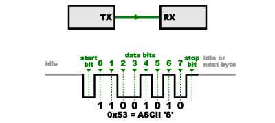
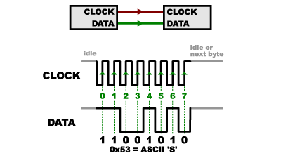
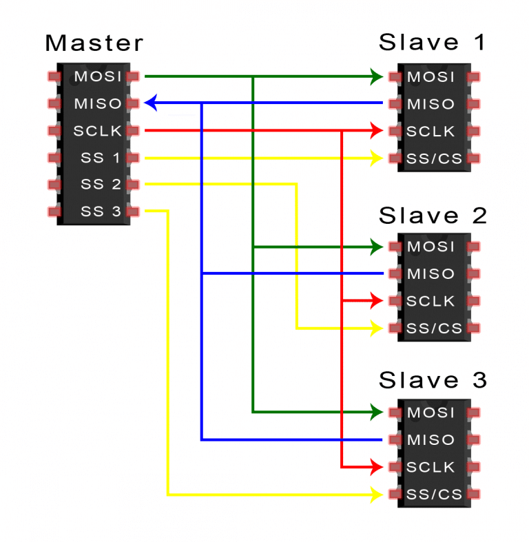
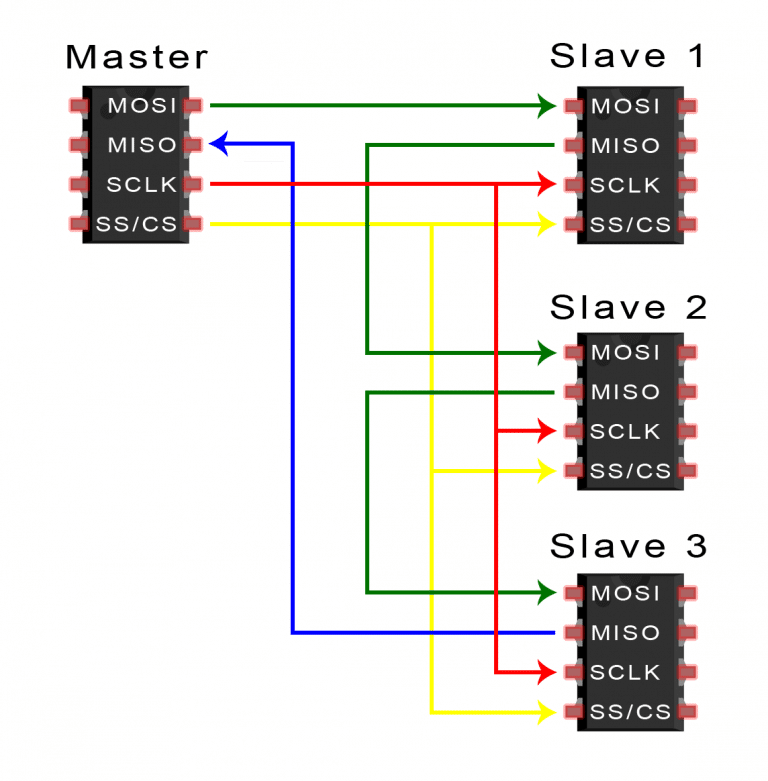
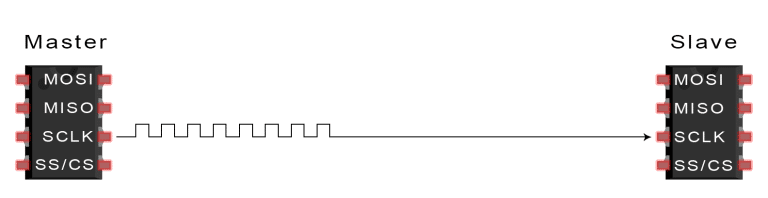
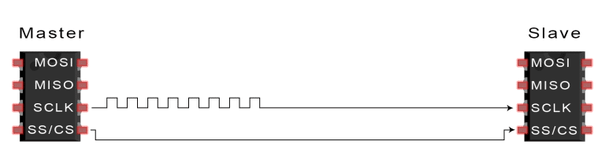
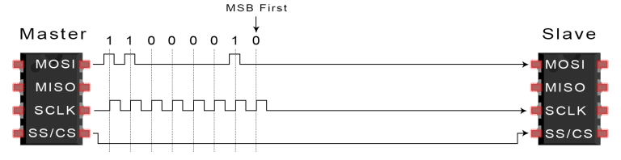
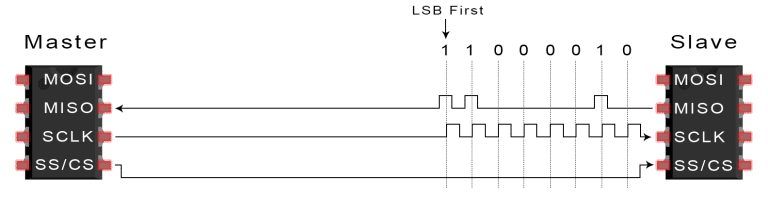

# SPI

## Introduction

**Serial Peripheral Interface (SPI)** is an interface bus commonly used to send data between microcontrollers and small peripherals such as shift registers, sensors, and SD cards. It uses separate clock and data lines, along with a select line to choose the device you wish to talk to.

## What's Wrong with Serial Ports?

A common serial port, the kind with TX and RX lines, is called "asynchronous" (not synchronous) because there is no control over when data is sent or any guarantee that both sides are running at precisely the same rate. Since computers normally rely on everything being synchronized to a single “clock” (the main crystal attached to a computer that drives everything), this can be a problem when two systems with slightly different clocks try to communicate with each other.

To work around this problem, asynchronous serial connections add extra start and stop bits to each byte help the receiver sync up to data as it arrives. Both sides must also agree on the transmission speed (such as 9600 bits per second) in advance. Slight differences in the transmission rate aren't a problem because the receiver re-syncs at the start of each byte.

  

(By the way, if you noticed that "11001010" does not equal 0x53 in the above diagram, kudos to your attention to detail. Serial protocols will often send the least significant bits first, so the smallest bit is on the far left. The lower nybble is actually 0011 = 0x3, and the upper nybble is 0101 = 0x5.)

Asynchronous serial works just fine, but has a lot of overhead in both the extra start and stop bits sent with every byte, and the complex hardware required to send and receive data. And as you've probably noticed in your own projects, if both sides aren't set to the same speed, the received data will be garbage. This is because the receiver is sampling the bits at very specific times (the arrows in the above diagram). If the receiver is looking at the wrong times, it will see the wrong bits.

## A Synchronous Solution

SPI works in a slightly different manner. It's a "synchronous" data bus, which means that it uses separate lines for data and a "clock" that keeps both sides in perfect sync. The clock is an oscillating signal that tells the receiver exactly when to sample the bits on the data line. This could be the rising (low to high) or falling (high to low) edge of the clock signal; the datasheet will specify which one to use. When the receiver detects that edge, it will immediately look at the data line to read the next bit (see the arrows in the below diagram). Because the clock is sent along with the data, specifying the speed isn't important, although devices will have a top speed at which they can operate (We'll discuss choosing the proper clock edge and speed in a bit).

  

One reason that SPI is so popular is that the receiving hardware can be a simple shift register. This is a much simpler (and cheaper!) piece of hardware than the full-up UART (Universal Asynchronous Receiver / Transmitter) that asynchronous serial requires.

## How SPI Works

### The Clock

The clock signal synchronizes the output of data bits from the master to the sampling of bits by the slave. One bit of data is transferred in each clock cycle, so the speed of data transfer is determined by the frequency of the clock signal. SPI communication is always initiated by the master since the master configures and generates the clock signal.

Any communication protocol where devices share a clock signal is known as synchronous. SPI is a synchronous communication protocol. There are also asynchronous methods that don’t use a clock signal. For example, in UART communication, both sides are set to a pre-configured baud rate that dictates the speed and timing of data transmission.

The clock signal in SPI can be modified using the properties of clock polarity and clock phase. These two properties work together to define when the bits are output and when they are sampled. Clock polarity can be set by the master to allow for bits to be output and sampled on either the rising or falling edge of the clock cycle. Clock phase can be set for output and sampling to occur on either the first edge or second edge of the clock cycle, regardless of whether it is rising or falling.

### Slave Select
The master can choose which slave it wants to talk to by setting the slave’s CS/SS line to a low voltage level. In the idle, non-transmitting state, the slave select line is kept at a high voltage level. Multiple CS/SS pins may be available on the master, which allows for multiple slaves to be wired in parallel. If only one CS/SS pin is present, multiple slaves can be wired to the master by daisy-chaining.

### Multiple Slaves
SPI can be set up to operate with a single master and a single slave, and it can be set up with multiple slaves controlled by a single master. There are two ways to connect multiple slaves to the master. If the master has multiple slave select pins, the slaves can be wired in parallel like this:

  

If only one slave select pin is available, the slaves can be daisy-chained like this:

  

### MOSI and MISO
The master sends data to the slave bit by bit, in serial through the MOSI line. The slave receives the data sent from the master at the MOSI pin. Data sent from the master to the slave is usually sent with the most significant bit first.

The slave can also send data back to the master through the MISO line in serial. The data sent from the slave back to the master is usually sent with the least significant bit first.

## Steps of SPI Data Transmission

1. The master outputs the clock signal:

  

2. The master switches the SS/CS pin to a low voltage state, which activates the slave:

  

3. The master sends the data one bit at a time to the slave along the MOSI line. The slave reads the bits as they are received:

  

4. If a response is needed, the slave returns data one bit at a time to the master along the MISO line. The master reads the bits as they are received:

  

## Advantages and Disadvantages of I2C
There are some advantages and disadvantages to using SPI, and if given the choice between different communication protocols, you should know when to use SPI according to the requirements of your project:

## Advantages
- No start and stop bits, so the data can be streamed continuously without interruption
- No complicated slave addressing system like I2C
- Higher data transfer rate than I2C (almost twice as fast)
- Separate MISO and MOSI lines, so data can be sent and received at the same time

## Disadvantages
- Uses four wires (I2C and UARTs use two)
- No acknowledgement that the data has been successfully received (I2C has this)
- No form of error checking like the parity bit in UART
- Only allows for a single master
