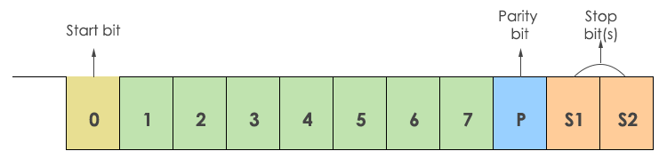
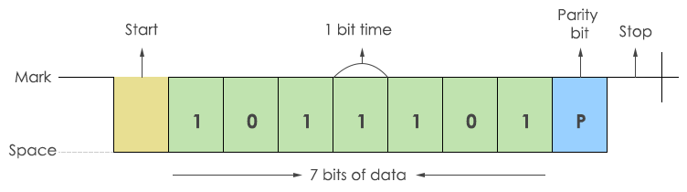
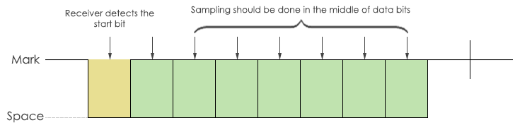

# UART

## Introduction

UART (Universal Asynchronous Transmitter Receiver), this is the most common protocol used for full duplex serial communication. It is a single LSI (large scale integration) chip designed to perform asynchronous communication. This device sends and receives data from one system to another system.

In UART communication, two UARTs communicate directly with each other. The transmitting UART converts parallel data from a controlling device like a CPU into serial form, transmits it in serial to the receiving UART, which then converts the serial data back into parallel data for the receiving device. Only two wires are needed to transmit data between two UARTs. Data flows from the Tx pin of the transmitting UART to the Rx pin of the receiving UART:

  

UARTs transmit data asynchronously, which means there is no clock signal to synchronize the output of bits from the transmitting UART to the sampling of bits by the receiving UART. Instead of a clock signal, the transmitting UART adds start and stop bits to the data packet being transferred. These bits define the beginning and end of the data packet so the receiving UART knows when to start reading the bits.

When the receiving UART detects a start bit, it starts to read the incoming bits at a specific frequency known as the baud rate. Baud rate is a measure of the speed of data transfer, expressed in bits per second (bps). Both UARTs must operate at about the same baud rate. The baud rate between the transmitting and receiving UARTs can only differ by about 10% before the timing of bits gets too far off.

## Protocol Format

The UART starts the communication with a start bit ‘0’. The start bit initiates the transfer of serial data and stop bit ends the data transaction.

  

It is also provided with a parity bit (even or odd). Even parity bit is represented by ‘0’ (even number of 1’s) and the odd parity bit is represented by ‘1’ (odd number of 1’s).

## Transmission

The transmission of data is done using a single transmission line (TxD).  Here ‘0’ is considered as space and ‘1’ is known as mark state.

  

The transmitter sends a single bit at a time. After sending one bit, the next bit is sent. In this way, all the data bits are sent to the receiver with a predefined baud rate. There will be a certain delay in transmitting each bit. For example, to send one byte of data at 9600 baud rate, each bit is sent at 108 µsec delay. The data is added with a parity bit. So, 10 bits of data are required to send 7 bits of data.

## Reception

During the reception, RxD line (Receiver) is used for receiving the data.

  

