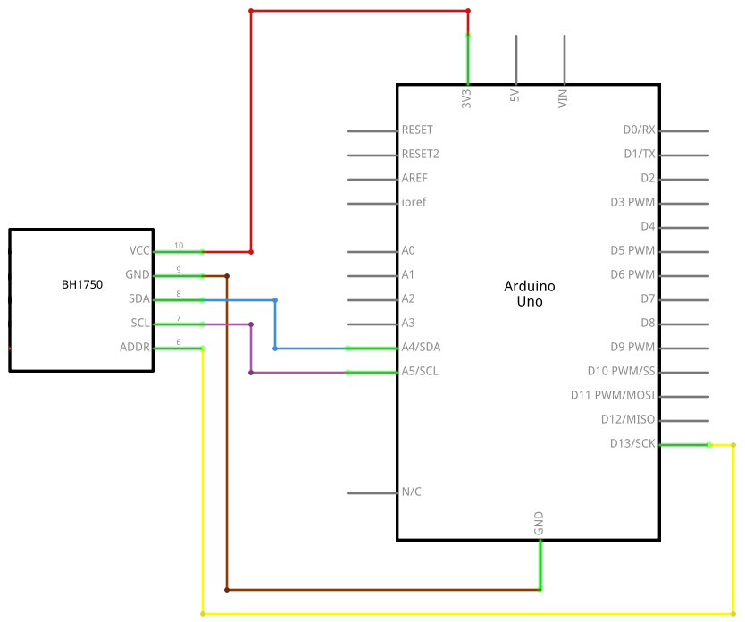

# BH1750

<p align="center">
  
</p>


## Description
BH1750 is a Digital Ambient **light sensor**. It is easy to interface with a microcontroller, as it uses the I2C communication protocol. It consumes a very low amount of current. This sensor uses a photodiode to sense the light. This photodiode contains a PN junction. When light falls on it, electron-hole pairs are created in the depletion region. Due to the internal photoelectric effect, electricity is produced in the photodiode. This produced electricity is proportional to the intensity of light. This electricity is changed into a voltage by the Opamp.


## Details
* Max Supply Voltage: 4.5 V
* Storage Temperature: -40～100 ℃
* Operating Temperature: -40~85 ℃
* SDA Sink Max Current: 7 mA


## Scheme
<p align="center">
  
</p>


# Code
```arduino

#include <Wire.h>
#include <BH1750FVI.h>

// Settings
uint8_t ADDRESSPIN = 13;
BH1750FVI::eDeviceAddress_t DEVICEADDRESS = BH1750FVI::k_DevAddress_H;
BH1750FVI::eDeviceMode_t DEVICEMODE = BH1750FVI::k_DevModeContHighRes;

// Create the Lightsensor instance
BH1750FVI LightSensor(ADDRESSPIN, DEVICEADDRESS, DEVICEMODE);

void setup() 
{
  Serial.begin(115200);
  LightSensor.begin();  
  Serial.println("Running...");
}

void loop()
{
  uint16_t lux = LightSensor.GetLightIntensity();
  Serial.print("Light: ");
  Serial.println(lux);
  delay(250);
}
```