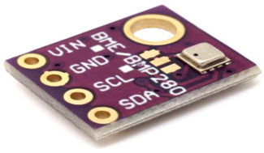
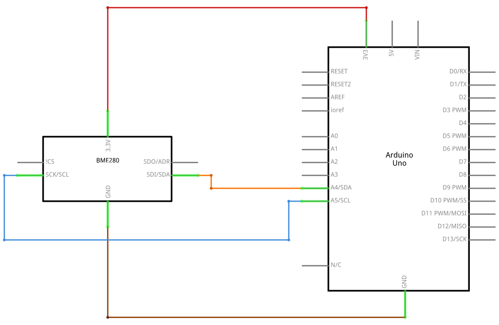

# BME280

  

## Description
THe BME280 module uses [BME280 sensor](https://www.bosch-sensortec.com/products/environmental-sensors/humidity-sensors-bme280/). The BME280 sensor is a humidity sensor especially developed for mobile applications and wearables where size and low power consumption are key design parameters. The unit combines high linearity and high accuracy sensors and is perfectly feasible for low current consumption, long-term stability and high EMC robustness. The humidity sensor offers an extremely fast response time and therefore supports performance requirements for emerging applications such as context awareness, and high accuracy over a wide temperature range.

## Details
* Pressure operation range: 300...1100 hPa
* Temperature operation range: -40…85°C
* Absolute accuracy: ±1 hPa
* Average typical current consumption (1 Hz data rate): 3.4 μA @ 1 Hz

## Scheme

  

## Code