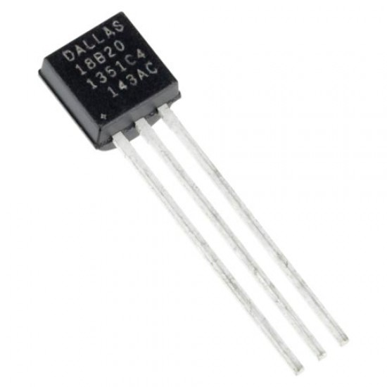
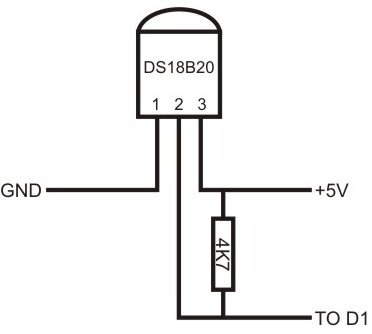

# DS18B20

  

## Description
The **DS18B20** is a 1-wire programmable Temperature sensor from maxim integrated. It is widely used to measure temperature in hard environments like in chemical solutions, mines or soil etc. The constriction of the sensor is rugged and also can be purchased with a waterproof option making the mounting process easy. It can measure a wide range of temperature from **-55°C** to **+125°** with a decent accuracy of **±0.5°C**. Each sensor has a unique address and requires only one pin of the MCU to transfer data so it a very good choice for measuring temperature at multiple points without compromising much of your digital pins on the microcontroller.

## Details
* Communicates using 1-Wire method
* Unique 64-bit address enables multiplexing
* Operating voltage: 3V to 5V
* Conversion time: 750ms at 12-bit
* Output Resolution: 9-bit to 12-bit (programmable)
* Temperature Range: -55°C to +125°C
* Accuracy: ±0.5°C
* Available as To-92, SOP and even as a waterproof sensor

## Scheme

  

## Code