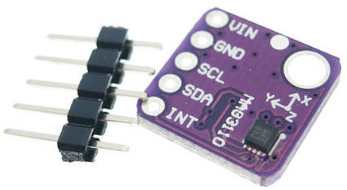
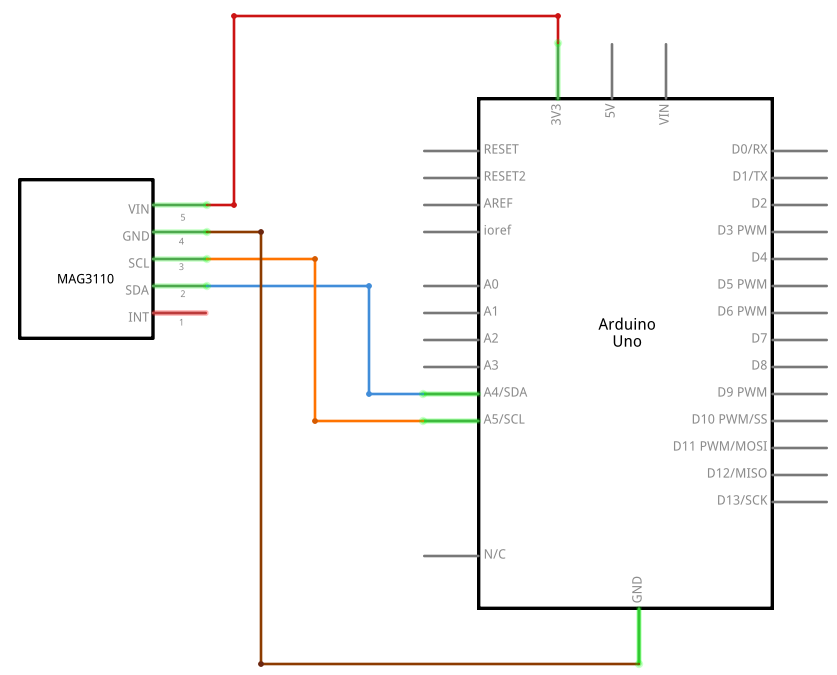

# MAG3110
<p align="center">
  
</p>


## Description
**MAG3110** is a small, low-power, digital 3-axis magnetometer. The device can be used in conjunction with a 3-axis accelerometer to produce orientation independent accurate compass heading information. It features a standard I2C serial interface output and smart embedded functions. It's also a tiny QFN package which isn't very easy to play with so here is our easy to use breakout board. This board breaks out all of the pins for the MAG3110 to a standard 0.1" header and also supplies the necessary filtering capacitors so that you can easily use it in your next navigation project.


## Details
* 1.95V to 3.6V Supply Voltage (VDD)
* Noise down to 0.25 μT rms
* Sensitivity of 0.10 μT
* Full Scale Range ±1000 μT
* I2C digital output interface (operates up to 400 kHz Fast Mode)
* 7-bit I2C address = 0x0E
* Working Temperature Range: 40°C to +85°C


## Scheme
<p align="center">
  
</p>


## Code
```arduino
#include <Wire.h>
#include "i2c.h"
#include "i2c_MAG3110.h"
MAG3110 mag3110;

void setup() {
    Serial.begin(115200);
    Serial.print("Probe MAG3310: ");
    if (mag3110.initialize())  Serial.println("Sensor found!");
    else {
        Serial.println("Sensor missing");
        while(1);
    }
}

void loop() {
    float xyz_uT[3];

    mag3110.getMeasurement(xyz_uT);

    Serial.print(" X: ");
    Serial.print(xyz_uT[0],2);
    Serial.print(" \tY: ");
    Serial.print(xyz_uT[1],2);
    Serial.print(" \tZ: ");
    Serial.print(xyz_uT[2],2);
    Serial.println("");
    delay(20);
}
```