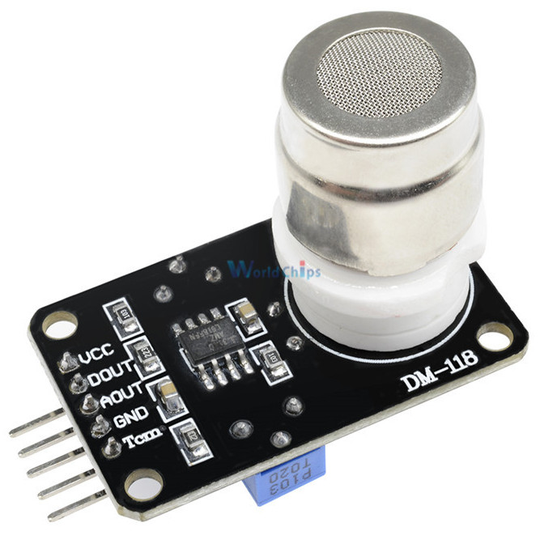
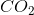
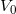
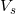
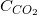
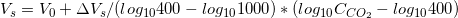
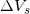

# MG811

<p align="center">
  
</p>


## Description
This sensor module has an MG-811 onboard as the sensor component. There is an onboard signal conditioning circuit for amplifying output signal and an onboard heating circuit for heating the sensor. The MG-811 is highly sensitive to CO2 and less sensitive to alcohol and CO. It could be used in air quality control, ferment process, in-door air monitoring application. The output voltage of the module falls as the concentration of the CO2 increases.


## Details
* Analog and digital output
* Onboard signal conditioning circuit
* Onboard heating circuit
* Sensor jack eliminates soldering the sensor and allows plug-and-play
* 4-pin interlock connectors onboard
* 4-pin interlock cables included in the package


## Theory
The **MG-811** sensor is basically a cell which gives an output in the range of 100-600mV (400—10000ppm ). The current sourcing capability of the cell is quite limited. The amplitude of the signal is so low and the output impedance of the cell is so high that a signal conditioning circuit is required between the sensor and microcontroller’s ADC input. The output voltage of the sensor in clean air (typically 400ppm ) is in the range of 200mV-600mV, this output voltage is defined as Zero Point Voltage () which is the baseline voltage. The output voltage will decrease as the  concentration increases. When the concentration of  is greater than 400ppm, the output voltage () is linear to the common logarithm of the  concentration ():



Reaction Voltage() is the voltage drop from  concentration of 400ppm to  concentration of 1000ppm, which may differ from sensor to sensor. The typical value for is 30mV-90mV. In order to get an accurate  concentration result, proper calibration is required.

The DC gain of the signal conditioning circuit is 8.5. So the range of VOUT is 0.85-5.0V, which is a reasonable range for a 5V microcontroller or standalone ADC.

The threshold of the comparator open drain output pin BOOL can be set by on-board trimmer R11. When VOUT is lower than the threshold voltage the BOOL is at ground potential. When VOUT is greater than the preset value, the BOOL is open circuit. User should connect a pull-up resistor to the BOOL pin in order to have a valid “high” state.


## Scheme


## Code
```arduino
/************************Hardware Related Macros************************************/
#define         MG_PIN                       (0)     //define which analog input channel you are going to use
#define         BOOL_PIN                     (2)
#define         DC_GAIN                      (8.5)   //define the DC gain of amplifier

/***********************Software Related Macros************************************/
#define         READ_SAMPLE_INTERVAL         (50)    //define how many samples you are going to take in normal operation
#define         READ_SAMPLE_TIMES            (5)     //define the time interval(in milisecond) between each samples in 
                                                     //normal operation

/**********************Application Related Macros**********************************/
//These two values differ from sensor to sensor. user should derermine this value.
#define         ZERO_POINT_VOLTAGE           (0.220) //define the output of the sensor in volts when the concentration of CO2 is 400PPM
#define         REACTION_VOLTGAE             (0.020) //define the voltage drop of the sensor when move the sensor from air into 1000ppm CO2

/*****************************Globals***********************************************/
float           CO2Curve[3]  =  {2.602,ZERO_POINT_VOLTAGE,(REACTION_VOLTGAE/(2.602-3))};   
                                                     //two points are taken from the curve. 
                                                     //with these two points, a line is formed which is
                                                     //"approximately equivalent" to the original curve.
                                                     //data format:{ x, y, slope}; point1: (lg400, 0.324), point2: (lg4000, 0.280) 
                                                     //slope = ( reaction voltage ) / (log400 –log1000) 

void setup()
{
    Serial.begin(9600);                              //UART setup, baudrate = 9600bps
    pinMode(BOOL_PIN, INPUT);                        //set pin to input
    digitalWrite(BOOL_PIN, HIGH);                    //turn on pullup resistors

   Serial.print("MG-811 Demostration\n");                
}

void loop()
{
    int percentage;
    float volts;

    volts = MGRead(MG_PIN);
    Serial.print( "SEN-00007:" );
    Serial.print(volts); 
    Serial.print( "V           " );

    percentage = MGGetPercentage(volts,CO2Curve);
    Serial.print("CO2:");
    if (percentage == -1) {
        Serial.print( "<400" );
    } else {
        Serial.print(percentage);
    }

    Serial.print( "ppm" );  
    Serial.print("\n");

    if (digitalRead(BOOL_PIN) ){
        Serial.print( "=====BOOL is HIGH======" );
    } else {
        Serial.print( "=====BOOL is LOW======" );
    }

    Serial.print("\n");

    delay(200);
}

/*****************************  MGRead *********************************************
Input:   mg_pin - analog channel
Output:  output of SEN-000007
Remarks: This function reads the output of SEN-000007
************************************************************************************/ 
float MGRead(int mg_pin)
{
    int i;
    float v=0;

    for (i=0;i<READ_SAMPLE_TIMES;i++) {
        v += analogRead(mg_pin);
        delay(READ_SAMPLE_INTERVAL);
    }
    v = (v/READ_SAMPLE_TIMES) *5/1024 ;
    return v;  
}

/*****************************  MQGetPercentage **********************************
Input:   volts   - SEN-000007 output measured in volts
         pcurve  - pointer to the curve of the target gas
Output:  ppm of the target gas
Remarks: By using the slope and a point of the line. The x(logarithmic value of ppm) 
         of the line could be derived if y(MG-811 output) is provided. As it is a 
         logarithmic coordinate, power of 10 is used to convert the result to non-logarithmic 
         value.
************************************************************************************/ 
int  MGGetPercentage(float volts, float *pcurve)
{
   if ((volts/DC_GAIN )>=ZERO_POINT_VOLTAGE) {
      return -1;
   } else { 
      return pow(10, ((volts/DC_GAIN)-pcurve[1])/pcurve[2]+pcurve[0]);
   }
}
```