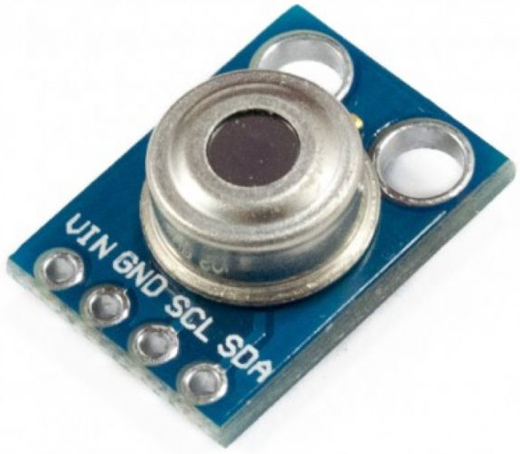
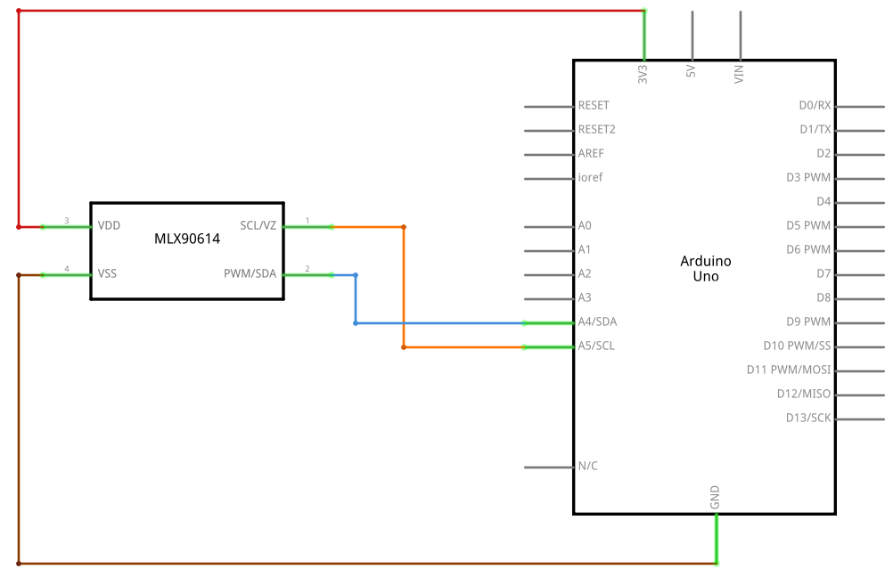

# MLX90614

  

## Description
This cyber-tronic looking sensor hides a secret behind it's glimmering eye. Unlike most temperature sensors, this sensor measures infrared light bouncing off of remote objects so it can sense temperature without having to touch them physically. Simply point the sensor towards what you want to measure and it will detect the temperature by absorbing IR waves emitted. Because it doesn't have to touch the object it's measuring, it can sense a wider range of temperatures than most digital sensors: from -70°C to +380°C! It takes the measurement over an 90-degree field of view so it can be handy for determining the average temperature of an area.

## Details
* Factory calibrated
* Sensor temperature range: -40°C to +125°C
* Object temperature range: -70°C to +380°C
* Accuracy around room temperatures: ±0.5°C
* 90° Field of view
* I2C interface, 0x5A is the fixed 7-bit address

## Scheme

  

## Code

