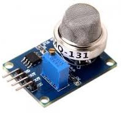
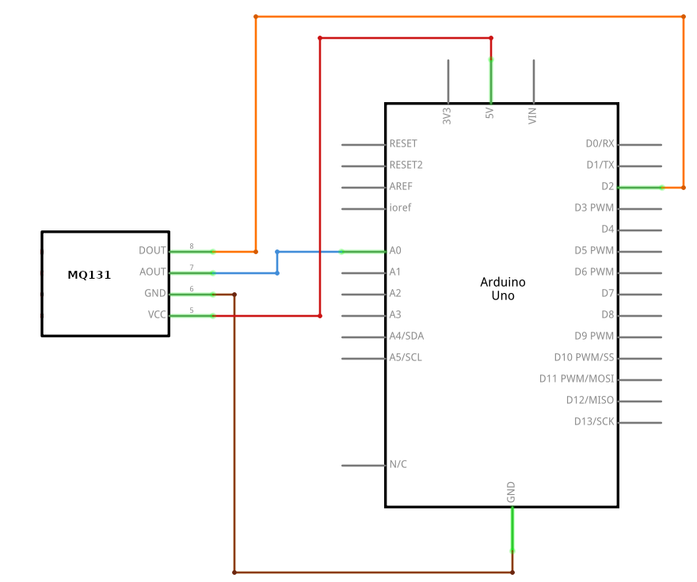

# MQ131

<p align="center">
  
</p>


## Description
MQ131 Gas Sensor has high sensitivity to ozone with long life, low cost and simple drive circuit. Its sensitive material SnO2 has a lower conductivity in clean air. Sensor's conductivity increases when the gas concentration rises.They are used in air quality control equipments for buildings/offices, are suitable for detecting Of O3.


## Details
* Operating Voltage: 4.5V to 5V DC.
* High sensitivity to Ozone Gas.
* Also sensitive to Chlorine (CL2) and Nitrogen dioxide (NO2)
* Interface type: Analog.


## Scheme
<p align="center">
  
</p>


## Code
```arduino
const int AOUTpin=0;
const int DOUTpin=2;

int limit;
int value;

void setup() {
  Serial.begin(115200);
  pinMode(DOUTpin, INPUT);
}

void loop() {
  value = analogRead(AOUTpin);
  limit = digitalRead(DOUTpin);
  Serial.print("O3 value: ");
  Serial.println(value);
  Serial.print("Limit: ");
  Serial.print(limit);
  delay(100);
  if (limit == HIGH){
    Serial.println("O3 level is HIGH")
  }
  else{
    Serial.println("O3 level is LOW")
  }
}
```