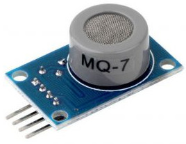
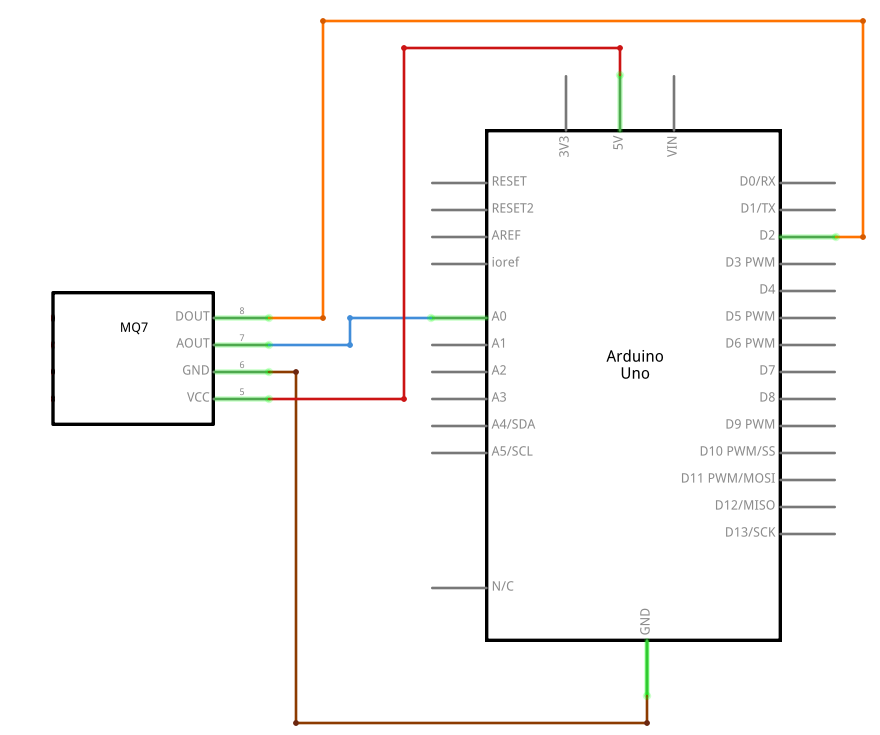

# MQ7

  

## Description
MQ-7 is a **Carbon Monoxide** (CO) sensor, suitable for sensing Carbon Monoxide concentrations(PPM) in the air. The MQ-7 sensor can measure CO concentrations ranging from 20 to 2000ppm.

## Details
* Using temperature: -20°C to +50°C
* Relative humidity: ≤95%RH
* Oxygen concentration: 21% (stand condition)

## Scheme

  

## Code