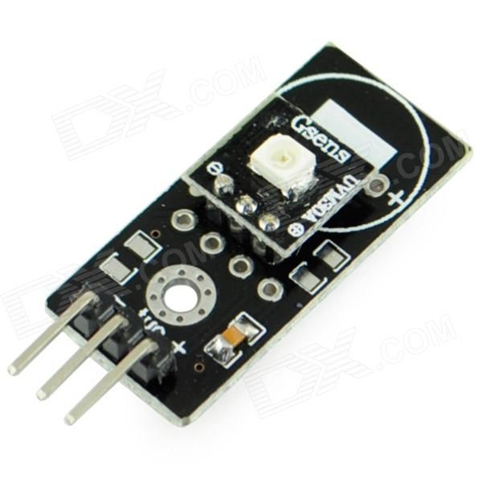
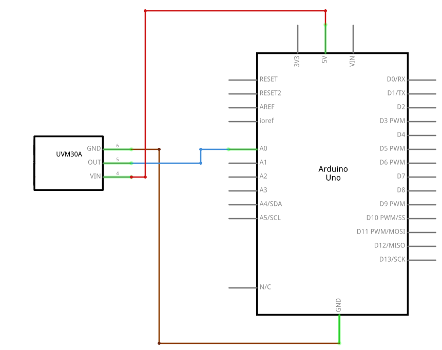

# UVM-30A

<p align="center">
  
</p>

## Description
This UVM-30A UV Sensor Breakout Board is used for detecting intensity of UltraViolet Radiation.

The module will detect this electromagnetic radiation and using the UVM30A chip it will convert the short wavelengths into digital signal for your microcontroller. It a great little sensor to tell how  much sunlight your plants are getting or if it’s the right day to put on sun cream before going out.


## Details
* Response Wavelength: 200-370nm
* Operating Temperature: -40 to 85°C
* Dimensions: 27 x 14 x 6 mm (L x W x H)


## Scheme
<p align="center">
  
</p>

## Code

```arduino
unsigned int Read_UV_index(int UVM30A_PIN) {
  int sensorValue = 0, voltage = 0;
  unsigned int UVIndex = 0;
  sensorValue = analogRead(UVM30A_PIN);
  voltage = (sensorValue * (5.0 / 1023.0))*1000;

  if (voltage<=227) UVIndex = 0;
  else if (voltage>227 && voltage<=318) UVIndex = 1;
  else if (voltage>318 && voltage<=408) UVIndex = 2;
  else if (voltage>408 && voltage<=503) UVIndex = 3;
  else if (voltage>503 && voltage<=606) UVIndex = 4;
  else if (voltage>606 && voltage<=696) UVIndex = 5;
  else if (voltage>696 && voltage<=795) UVIndex = 6;
  else if (voltage>795 && voltage<=881) UVIndex = 7;
  else if (voltage>881 && voltage<=976) UVIndex = 8;
  else if (voltage>976 && voltage<=1079) UVIndex = 9;
  else if (voltage>1079 && voltage<=1170) UVIndex = 10;
  else UVIndex = 11;

  return UVIndex;
}
```